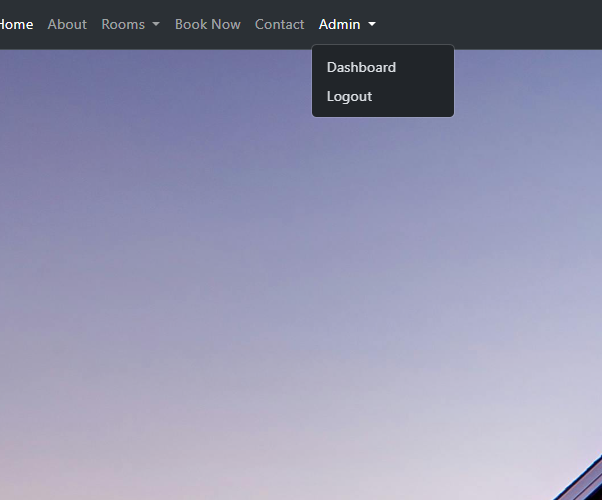

# Bookings and Reservations Project.

- Built in Go version 1.23.3
- Uses the [chi router](github.com/alexedwards/scs/v2)
- Uses [alex edwards SCS](github.com/go-chi/chi/v5) seassion management
- Uses [nsurf](github.com/justinas/nosurf)

## **Project Overview**
The **Bookings and Reservations System** is a full-stack web application designed to simplify the booking process for customers and streamline reservation management for hotels. This project provides a seamless user experience, integrating a responsive front-end with a robust back-end.

---

## **Setup and Installation**

### **Prerequisites:**
- Go installed on your system.
- PostgreSQL database set up and running.
- Optional: MailHog installed for email testing.

### **Steps to Run Locally:**
1. Clone the repository:
   ```bash
   git clone https://github.com/fuad7161/Golang
   cd Golang/cmd/web
   ```

2. Set up the environment variables for database connection:
- Update your PostgreSQL connection string in the application config.

3. Install required Go packages:
   ```bash
   go mod tidy
   ```

4. Run the application:
   ```bash
   go run .
   ```

5. Access the application in your browser at `http://localhost:8080`.

---
## **Technology and Tools**

### **Front-end:**
- **HTML**, **CSS**, **JavaScript**, and **Bootstrap** for building a responsive and user-friendly interface.

### **Back-end:**
- **Golang** for server-side development.
- Key Libraries/Packages:
  - **Routing and Middleware:** `github.com/go-chi/chi`, `github.com/gorilla/mux`
  - **Session Management:** `github.com/alexedwards/scs/v2`
  - **Validation:** `github.com/asaskevich/govalidator`
  - **CSRF Protection:** `github.com/justinas/nosurf`
  - **Database Handling:** `github.com/jackc/pgx/v4`
  - **Email Services:** `github.com/xhit/go-simple-mail/v2`, `github.com/mailhog`

### **Database:**
- **PostgreSQL** for efficient data storage and management.
  1. **Room_Restrictions** - Stores room-specific restrictions (e.g., availability, maintenance).
  2. **Room_reservations** - Tracks the reservations made for rooms.
  3. **Reservations** - Stores the overall reservation details.
  4. **Restrictions** - General restrictions (e.g., date, booking limits).
  5. **Room** - Contains information about each room (e.g., type, capacity, price).
  6. **User** - Stores user information (e.g., name, email, password).
  
### **Testing and Mail Services:**
- **MailHog** for email testing.
- **Static File Serving:** `http.FileServer` for serving static assets.
- **Postman**  for API validation.

---

## **Future Enhancements**


### **Public APIs:**
- **Home and Information Pages:**
  - `/` - Home page
  - `/about` - About us
  - `/contact` - Contact page

- **User Authentication:**
  - `/user/login` (GET, POST) - Login functionality
  - `/user/logout` - Logout endpoint

- **Room Reservations:**
  - `/reservation` (GET, POST) - Make a reservation
  - `/reservation-summary` - View reservation summary
  - `/search-availability` (GET, POST) - Search room availability
  - `/choose-room/{id}` - Choose a specific room
  - `/book-room` - Book a selected room

- **Static File Handling:**
  - `/static/*` - Serves static files (CSS, JS, images)

### **Admin APIs:**
- **Dashboard and Management:**
  - `/admin/dashboard` - Admin dashboard
  - `/admin/reservations-new` - View new reservations
  - `/admin/reservations-all` - View all reservations
  - `/admin/reservations-calendar` (GET, POST) - Manage reservations via calendar
  - `/admin/reservations/{src}/{id}` (GET, POST) - View and edit individual reservations

### **Database Management APIs:**
- `/addUser` (GET, POST) - Add a new user
- `/show-all-User` - Display all users

---
### 7. General Quarters View
- **Screenshot**: 
- Displays a general view of room categories and availability.

### 6. Date Picker for Reservations
- **Screenshot**: 
- Allows users to select dates easily for booking.

### 16. Selected Date Information
- **Screenshot**: 
- Displays details of reservations and room statuses for the selected date.

### 15. Room Availability Page
- **Screenshot**: 
- Shows the availability status of rooms.

### 5. Available Room Search
- **Screenshot**: 
- Users can search for available rooms based on dates and preferences.

### 9. Make Reservation Page
- **Screenshot**: 
- Page for users to make new reservations.

### 17. Validation Check Page
- **Screenshot**: 
- Ensures all user inputs meet the requirements for successful reservation.

### 8. Mail Body Template
- **Screenshot**: 
- Email template for reservation confirmation or updates.

### 14. Reservation Summary
- **Screenshot**: 
- Summarizes details of a particular reservation.

### 10. Not Available Response
- **Screenshot**: 
- Displays a message when no rooms are available for selected dates.

### 4. Admin Login
- **Screenshot**: 
- Secure login interface for administrators.

### 3. Admin Dropdown Options
- **Screenshot**: 
- Quick navigation for admin functionalities.

### 1. Admin Dashboard
- **Screenshot**: 
- A centralized view for administrators to manage the system.

### 11. Registered User Page
- **Screenshot**: 
- A page to view and manage registered users.

### 12. Reservation Calendar
- **Screenshot**: 
- Calendar view of reservations for easy tracking.

### 13. Reservation List
- **Screenshot**: 
- Displays a detailed list of all reservations.

### 2. Reservation Summary View
- **Screenshot**: 
- Provides an overview of key metrics and hotel operations.


---

## **Contact**
For any inquiries or feedback, feel free to reach out:
- **Email:** fuadul202@gmail.com
- **GitHub:** https://github.com/fuad7161
